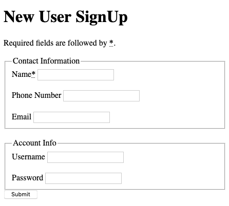

# HTML Snippets

## Form
A fully formed form element in HTML taking advantage of `fieldset`, `legend`, and `input` types. The `name` attribute is used to set the key of the key, value pair when submitting data from the client's form to a server.

## Table
A very basic table with way more markup than needed as a demonstration of what can be done. Specifically, `scope` in a `th` element can be used to determine if a header cell is the header for a row or column, and `headers` within a `td` element can denote the amount of rows or columns that a cell occupies.